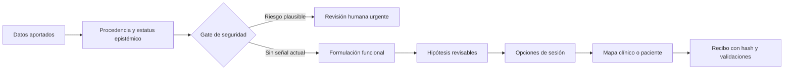
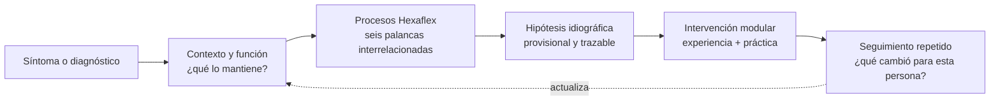
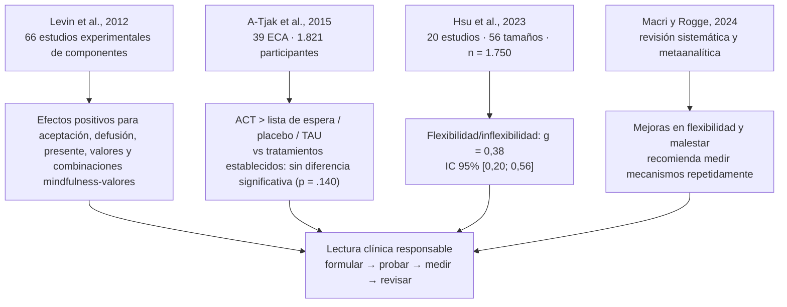

# Clinical Practice Maps

> **Una skill visual y segura para pensar, conversar y planificar en psicología clínica.**

[](https://github.com/JohanSabino/PsySkillClinical/actions/workflows/ci.yml)
[](LICENSE)
[](https://nodejs.org/)
[](#privacidad-y-seguridad)

Clinical Practice Maps convierte información clínica **sintética o autorizada** en formulaciones funcionales, propuestas colaborativas de sesión y mapas HTML que se pueden revisar con un profesional o utilizar como psicoeducación. El profesional elige el modelo de intervención (ACT/Hexaflex, CBT, DBT u otro); la herramienta no impone una teoría clínica.

Está diseñada para trabajar dentro de agentes como **Codex, Claude Code y OpenCode**. El paquete no crea diagnósticos ni reemplaza el juicio clínico: ayuda a hacer visibles las hipótesis, los constructos del modelo elegido y los siguientes pasos conversables.

## ✨ Qué aporta

| Capacidad | Resultado |
| --- | --- |
| **Formulación guiada por el modelo** | Conecta contexto, experiencia, conducta, función e hipótesis revisables según el marco que el profesional haya seleccionado. |
| **Planificación de sesiones** | Propone focos, preguntas y experimentos experienciales sin imponer una secuencia ni una duración fija. |
| **Mapas visuales compactos** | Ciclo funcional, objetivos/acciones y hoja de ruta; el radial Hexaflex aparece solo si se elige ACT/Hexaflex. |
| **Dos audiencias** | Vista clínica completa y proyección paciente mediante una allowlist explícita. |
| **Safety gate** | Detiene la planificación rutinaria ante señales plausibles de riesgo y pide revisión humana urgente. |
| **Privacidad local-first** | Sin cuenta, servidor, CDN, telemetría ni llamadas de red para validar o renderizar. |

Al iniciar una sesión la skill pregunta por el modelo de intervención, tu rol, objetivo, documentos disponibles, política de fuentes, audiencia y modo de privacidad. No asume ACT si eliges otro marco.

## 🚀 Instalación en un agente

Desde cualquier proyecto:

```bash
npx skills add JohanSabino/PsySkillClinical -g
```

Instalar para varios agentes en el proyecto actual:

```bash
npx skills add JohanSabino/PsySkillClinical --agent codex claude-code opencode --copy --yes
```

Probar de forma temporal:

```bash
npx skills use JohanSabino/PsySkillClinical@hexaflex-clinical --agent codex
```

Después, invoca la skill con solicitudes como:

> «Construye una formulación funcional provisional con los datos aportados, conserva los desconocidos, propone preguntas colaborativas y genera una vista paciente sin notas privadas.»

## 🧭 Cómo piensa la skill



El flujo conserva la diferencia entre reporte, observación, medida, documento, inferencia y desconocido. Una hipótesis no se convierte en hecho por repetirse; las decisiones compartidas quedan marcadas como tales.

## 🧪 Si eliges ACT: por qué el Hexaflex representa un cambio de paradigma

Esta sección es opcional y solo aplica si seleccionas ACT/Hexaflex. Usamos **“revolución” como una afirmación conceptual**, no como una promesa de superioridad universal. El Hexaflex cambia la unidad de análisis: en lugar de preguntar solamente *“¿qué diagnóstico tiene la persona y qué protocolo le corresponde?”*, invita a estudiar **qué procesos contextuales mantienen el sufrimiento, en qué situaciones aparecen y qué conducta valiosa puede construirse a continuación**. Esta lógica es coherente con el giro hacia terapias basadas en procesos, funcionales e idiográficas (Hayes, Hofmann y Ciarrochi, 2020; Moskow et al., 2023).

Los seis procesos no son etapas lineales ni casillas que haya que “completar”. Forman un mapa clínico interrelacionado: se seleccionan y se miden según la persona, su contexto y el objetivo acordado.

| Proceso | Pregunta clínica breve |
| --- | --- |
| **Aceptación** | ¿Puede abrirse espacio a la experiencia difícil sin convertirla en una lucha obligatoria? |
| **Defusión** | ¿Puede observar pensamientos como eventos, en vez de obedecerlos automáticamente? |
| **Contacto con el presente** | ¿Qué información útil está disponible aquí y ahora? |
| **Yo-como-contexto** | ¿Puede notar que es más amplio que cualquier historia, rol o diagnóstico? |
| **Valores** | ¿Qué cualidad de vida quiere encarnar, aunque no sea una meta que se “termine”? |
| **Acción comprometida** | ¿Cuál es el siguiente paso pequeño, observable y revisable? |

### Del paquete diagnóstico al proceso que se puede modificar (lente ACT opcional)



La propuesta es revolucionaria por su **utilidad organizadora**: permite conectar evidencia, contexto y decisiones compartidas sin convertir el diagrama en un diagnóstico automático. La flexibilidad psicológica se ha descrito como una capacidad dinámica para adaptarse a demandas situacionales y actuar de forma congruente con valores (Kashdan y Rottenberg, 2010). Si se selecciona CBT, DBT u otro marco, este bloque se conserva como referencia educativa y no dirige la formulación.

### Qué respalda la evidencia (y qué no)

El siguiente mapa resume resultados de revisiones y metaanálisis. Las cifras pertenecen a poblaciones, comparadores y medidas diferentes; **no deben sumarse ni leerse como una clasificación entre estudios**.



| Hallazgo | Lectura útil para la skill | Límite que conservamos |
| --- | --- | --- |
| Componentes aislados muestran efectos experimentales positivos (Levin et al., 2012). | Se pueden proponer ejercicios experienciales dirigidos a un proceso. | Un efecto de laboratorio no prueba que un ejercicio sea el mecanismo causal en cada caso. |
| ACT supera controles pasivos o TAU en el metaanálisis de A-Tjak et al. (2015). | Es razonable considerar ACT una opción basada en evidencia. | No fue superior a tratamientos establecidos; no se presenta como “la mejor” terapia. |
| En universitarios, Hsu et al. (2023) encontró `g = 0,38`. | La flexibilidad/inflexibilidad es un resultado medible y sensible al cambio. | La muestra fue de estudiantes; no se generaliza automáticamente a toda la práctica clínica. |
| Macri y Rogge (2024) vinculan cambios en flexibilidad e inflexibilidad con cambios en malestar. | Conviene medir procesos y resultados varias veces, no solo al final. | Asociación o mediación estadística no equivale por sí sola a causalidad individual. |

> **Regla de oro:** el Hexaflex es un mapa de hipótesis, no un test, un algoritmo diagnóstico ni una garantía de resultado. McLoughlin y Roche (2023) señalan limitaciones importantes en la medición de los procesos y en la evidencia de que los seis componentes formen siempre un único mecanismo global. Por eso esta skill conserva desconocidos, exige revisión profesional y evita puntuar a la persona como “más” o “menos” Hexaflex.

### Referencias científicas (APA 7)

- A-Tjak, J. G. L., Davis, M. L., Morina, N., Powers, M. B., Smits, J. A. J., & Emmelkamp, P. M. G. (2015). A meta-analysis of the efficacy of acceptance and commitment therapy for clinically relevant mental and physical health problems. *Psychotherapy and Psychosomatics, 84*(1), 30–36. https://doi.org/10.1159/000365764
- Hayes, S. C., Hofmann, S. G., & Ciarrochi, J. (2020). A process-based approach to psychological diagnosis and treatment: The conceptual and treatment utility of an extended evolutionary meta model. *Clinical Psychology Review, 82*, 101908. https://doi.org/10.1016/j.cpr.2020.101908
- Hsu, T., Adamowicz, J. L., & Thomas, E. B. K. (2023). The effect of acceptance and commitment therapy on the psychological flexibility and inflexibility of undergraduate students: A systematic review and three-level meta-analysis. *Journal of Contextual Behavioral Science, 30*, 169–180. https://doi.org/10.1016/j.jcbs.2023.10.006
- Kashdan, T. B., & Rottenberg, J. (2010). Psychological flexibility as a fundamental aspect of health. *Clinical Psychology Review, 30*(7), 865–878. https://doi.org/10.1016/j.cpr.2010.03.001
- Levin, M. E., Hildebrandt, M. J., Lillis, J., & Hayes, S. C. (2012). The impact of treatment components suggested by the psychological flexibility model: A meta-analysis of laboratory-based component studies. *Behavior Therapy, 43*(4), 741–756. https://doi.org/10.1016/j.beth.2012.05.003
- Macri, J. A., & Rogge, R. D. (2024). Examining domains of psychological flexibility and inflexibility as treatment mechanisms in acceptance and commitment therapy: A comprehensive systematic and meta-analytic review. *Clinical Psychology Review, 110*, 102432. https://doi.org/10.1016/j.cpr.2024.102432
- McLoughlin, S., & Roche, B. T. (2023). ACT: A process-based therapy in search of a process. *Behavior Therapy, 54*(6), 939–955. https://doi.org/10.1016/j.beth.2022.07.010
- Moskow, D. M., Ong, C. W., Hayes, S. C., & Hofmann, S. G. (2023). Process-based therapy: A personalized approach to treatment. *Journal of Experimental Psychopathology, 14*(1), 1–8. https://doi.org/10.1177/20438087231152848

## 🎨 Artefactos HTML incluidos

- [Mapa clínico de ejemplo](dist/hexaflex.html)
- [Vista paciente de ejemplo](dist/hexaflex-paciente.html)
- [Recibo de validación clínica](dist/hexaflex.html.receipt.json)
- [ZIP portable reproducible](dist/hexaflex-clinical.zip)

Los HTML son autocontenidos, funcionan offline, incluyen navegación por teclado, estructura semántica, cinco presets (`sage`, `ocean`, `amber`, `plum`, `high-contrast`), modo `system`/claro/oscuro y soporte para `prefers-reduced-motion`. El radial de seis procesos se genera solo cuando el modelo elegido es ACT/Hexaflex; con CBT, DBT u otro marco se mantiene un mapa genérico sin imponer constructos.

## 🛠️ Desarrollo local

Requiere Node.js 18 o superior. No hay dependencias runtime externas.

```bash
npm test
npm run doctor
npm run validate
npm run render
npm run feedback
npm run package
```

Para renderizar una fuente propia:

```bash
node scripts/validate.mjs ruta/caso.json
node scripts/render.mjs ruta/caso.json salida.html --view all --audience clinical
node scripts/render.mjs ruta/caso.json salida-paciente.html --view all --audience patient --confirm-share
node scripts/ingest.mjs inputs manifest.json
node scripts/privacy.mjs ruta/caso.json ruta/model-ready.json --mode redact
node scripts/feedback.mjs ruta/feedback-draft.json ruta/feedback-ready.json --confirmed --mode redact
```

El caso de referencia es completamente sintético y está en [`examples/synthetic-case.json`](examples/synthetic-case.json).

Para documentos, indica una carpeta `inputs/`; si no existe, la skill ofrece crearla y espera confirmación explícita. Luego muestra un manifiesto y confirma los archivos que quieres usar. PDF y DOCX se procesan solo si existe un extractor local (`pdftotext` o `pandoc`); de lo contrario quedan como `unsupported` y la skill explica cómo aportar texto extraído sin subirlo a la red. La ingestión aplica límites configurables (5 MB, 20 archivos y 100 páginas por defecto). La política `documents_only` es la opción más restrictiva; `documents_plus_external` exige consentimiento y trazabilidad —URL, fecha, título, fragmento y hash— de cada fuente.

### Feedback local y revisión

Cada HTML incluye preguntas distintas para colaboración del paciente o revisión profesional. El botón de exportación es explícito: genera un `feedback.json` local, redacta identificadores y deja un recibo y diff para revisión. No se guarda texto clínico en `localStorage` ni se realizan llamadas de red. Para incorporar un feedback aprobado, usa `incorporateFeedback` desde `scripts/feedback.mjs`; se crea una nueva revisión/versionado y no se sobrescribe el artefacto anterior.

## 🔐 Privacidad y seguridad

Esta skill está acotada a profesionales cualificados y supervisión clínica. No diagnostica, prescribe medicación, evalúa por sí sola la inminencia del riesgo ni sustituye consentimiento, protocolos locales, supervisión o atención de crisis.

Si aparece una señal plausible de suicidio, autolesión, violencia o abuso actual, el renderer **rechaza el artefacto ordinario** y devuelve una salida para evaluación humana urgente. Las negaciones, referencias históricas y frases ambiguas se conservan como advertencias; nunca se presentan como una garantía de seguridad.

Antes de compartir una vista paciente, el caso debe marcar explícitamente `confirmed_share: true`. La proyección utiliza una allowlist y excluye identificadores, notas privadas, hipótesis no autorizadas y material clínico interno.

La redacción local es predeterminada. Si se usa pseudonimización, el mapping es efímero o cifrado local y nunca se envía. No se debe mandar texto crudo a otro agente para “camuflarlo”: el payload se escanea dos veces y falla cerrado cuando no puede inspeccionarse.

## 🧩 Arquitectura

La implementación toma de Archify una idea estructural —**IR JSON tipado → validación determinista → artefacto HTML autocontenido**—, pero reemplaza su ontología arquitectónica por una capa clínica configurable: formulación funcional, modelo de intervención elegido y límites de seguridad propios. El radial ACT/Hexaflex es una proyección opcional. Consulta [`PROVENANCE.md`](PROVENANCE.md) y [`THIRD_PARTY_NOTICES.md`](THIRD_PARTY_NOTICES.md) para el detalle de procedencia y licencia.

```text
SKILL.md                 Router, límites y contrato de uso
schemas/                 Contratos JSON de caso y visualización
references/              Formulación, sesiones, intervenciones, seguridad y lenguaje visual
scripts/validate.mjs     Validación, privacidad y gate conservador de riesgo
scripts/render.mjs       HTML/SVG autocontenido y recibo de entrega
scripts/doctor.mjs       Diagnóstico del paquete y smoke test offline
scripts/package.mjs      ZIP determinista sin dependencias
tests/                   Pruebas de comportamiento y matriz de aceptación
```

## 📌 Estado del proyecto

La base técnica está implementada y validada. Antes de una versión clínica pública todavía corresponde:

1. realizar una revisión independiente con profesionales sobre casos sintéticos;
2. acordar protocolo local de uso y supervisión;
3. etiquetar una versión después de esa revisión.

Las decisiones y tareas del cambio se mantienen en el workspace de desarrollo y se reflejan en la matriz de aceptación incluida en [`tests/acceptance-matrix.md`](tests/acceptance-matrix.md).

## 📄 Licencia

MIT. Ver [`LICENSE`](LICENSE).
