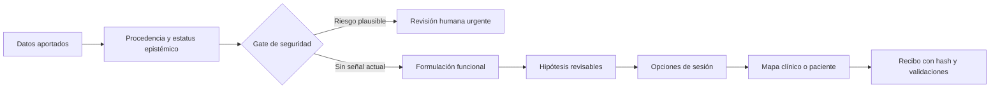

# Hexaflex Clinical

> **Una skill visual y segura para pensar, conversar y planificar desde ACT.**

[](https://github.com/JohanSabino/PsySkillClinical/actions/workflows/ci.yml)
[](LICENSE)
[](https://nodejs.org/)
[](#privacidad-y-seguridad)

Hexaflex Clinical convierte información clínica **sintética o autorizada** en formulaciones funcionales, propuestas colaborativas de sesión y mapas HTML que se pueden revisar con un profesional o utilizar como psicoeducación.

Está diseñada para trabajar dentro de agentes como **Codex, Claude Code y OpenCode**. El paquete no crea diagnósticos ni reemplaza el juicio clínico: ayuda a hacer visibles las hipótesis, los procesos ACT, los valores y los siguientes pasos conversables.

## ✨ Qué aporta

| Capacidad | Resultado |
| --- | --- |
| **Formulación Hexaflex** | Conecta contexto, experiencia, conducta, función e hipótesis revisables en los seis procesos ACT. |
| **Planificación de sesiones** | Propone focos, preguntas y experimentos experienciales sin imponer una secuencia ni una duración fija. |
| **Cuatro mapas visuales** | Hexaflex contextual, ciclo funcional, brújula valores–acciones y hoja de ruta de sesiones. |
| **Dos audiencias** | Vista clínica completa y proyección paciente mediante una allowlist explícita. |
| **Safety gate** | Detiene la planificación rutinaria ante señales plausibles de riesgo y pide revisión humana urgente. |
| **Privacidad local-first** | Sin cuenta, servidor, CDN, telemetría ni llamadas de red para validar o renderizar. |

Al iniciar una sesión la skill pregunta por el modelo de intervención, tu rol, objetivo, documentos disponibles, política de fuentes, audiencia y modo de privacidad. No asume ACT si eliges otro marco.

## 🚀 Instalación en un agente

Desde cualquier proyecto:

```bash
npx skills add JohanSabino/PsySkillClinical -g
```

Instalar para varios agentes en el proyecto actual:

```bash
npx skills add JohanSabino/PsySkillClinical --agent codex claude-code opencode --copy --yes
```

Probar de forma temporal:

```bash
npx skills use JohanSabino/PsySkillClinical@hexaflex-clinical --agent codex
```

Después, invoca la skill con solicitudes como:

> «Construye una formulación funcional provisional con los datos aportados, conserva los desconocidos, propone preguntas colaborativas y genera una vista paciente sin notas privadas.»

## 🧭 Cómo piensa la skill



El flujo conserva la diferencia entre reporte, observación, medida, documento, inferencia y desconocido. Una hipótesis no se convierte en hecho por repetirse; las decisiones compartidas quedan marcadas como tales.

## 🎨 Artefactos HTML incluidos

- [Mapa clínico de ejemplo](dist/hexaflex.html)
- [Vista paciente de ejemplo](dist/hexaflex-paciente.html)
- [Recibo de validación clínica](dist/hexaflex.html.receipt.json)
- [ZIP portable reproducible](dist/hexaflex-clinical.zip)

Los HTML son autocontenidos, funcionan offline, incluyen navegación por teclado, estructura semántica, contraste cuidado, modo claro/oscuro y soporte para `prefers-reduced-motion`.

## 🛠️ Desarrollo local

Requiere Node.js 18 o superior. No hay dependencias runtime externas.

```bash
npm test
npm run doctor
npm run validate
npm run render
npm run package
```

Para renderizar una fuente propia:

```bash
node scripts/validate.mjs ruta/caso.json
node scripts/render.mjs ruta/caso.json salida.html --view all --audience clinical
node scripts/render.mjs ruta/caso.json salida-paciente.html --view all --audience patient --confirm-share
node scripts/ingest.mjs inputs manifest.json
node scripts/privacy.mjs ruta/caso.json ruta/model-ready.json --mode redact
```

El caso de referencia es completamente sintético y está en [`examples/synthetic-case.json`](examples/synthetic-case.json).

Para documentos, crea una carpeta `inputs/` y confirma los archivos que quieres usar. PDF y DOCX se procesan solo si existe un extractor local (`pdftotext` o `pandoc`); de lo contrario quedan como `unsupported` y la skill explica cómo aportar texto extraído sin subirlo a la red. La ingestión aplica límites configurables (5 MB, 20 archivos y 100 páginas por defecto). La política `documents_only` es la opción más restrictiva; `documents_plus_external` exige consentimiento y trazabilidad —URL, fecha, título, fragmento y hash— de cada fuente.

## 🔐 Privacidad y seguridad

Esta skill está acotada a profesionales cualificados y supervisión clínica. No diagnostica, prescribe medicación, evalúa por sí sola la inminencia del riesgo ni sustituye consentimiento, protocolos locales, supervisión o atención de crisis.

Si aparece una señal plausible de suicidio, autolesión, violencia o abuso actual, el renderer **rechaza el artefacto ordinario** y devuelve una salida para evaluación humana urgente. Las negaciones, referencias históricas y frases ambiguas se conservan como advertencias; nunca se presentan como una garantía de seguridad.

Antes de compartir una vista paciente, el caso debe marcar explícitamente `confirmed_share: true`. La proyección utiliza una allowlist y excluye identificadores, notas privadas, hipótesis no autorizadas y material clínico interno.

La redacción local es predeterminada. Si se usa pseudonimización, el mapping es efímero o cifrado local y nunca se envía. No se debe mandar texto crudo a otro agente para “camuflarlo”: el payload se escanea dos veces y falla cerrado cuando no puede inspeccionarse.

## 🧩 Arquitectura

La implementación toma de Archify una idea estructural —**IR JSON tipado → validación determinista → artefacto HTML autocontenido**—, pero reemplaza su ontología arquitectónica por procesos ACT, formulación funcional y límites clínicos propios. Consulta [`PROVENANCE.md`](PROVENANCE.md) y [`THIRD_PARTY_NOTICES.md`](THIRD_PARTY_NOTICES.md) para el detalle de procedencia y licencia.

```text
SKILL.md                 Router, límites y contrato de uso
schemas/                 Contratos JSON de caso y visualización
references/              Formulación, sesiones, intervenciones, seguridad y lenguaje visual
scripts/validate.mjs     Validación, privacidad y gate conservador de riesgo
scripts/render.mjs       HTML/SVG autocontenido y recibo de entrega
scripts/doctor.mjs       Diagnóstico del paquete y smoke test offline
scripts/package.mjs      ZIP determinista sin dependencias
tests/                   Pruebas de comportamiento y matriz de aceptación
```

## 📌 Estado del proyecto

La base técnica está implementada y validada. Antes de una versión clínica pública todavía corresponde:

1. realizar una revisión independiente con profesionales sobre casos sintéticos;
2. acordar protocolo local de uso y supervisión;
3. etiquetar una versión después de esa revisión.

Las decisiones y tareas del cambio se mantienen en el workspace de desarrollo y se reflejan en la matriz de aceptación incluida en [`tests/acceptance-matrix.md`](tests/acceptance-matrix.md).

## 📄 Licencia

MIT. Ver [`LICENSE`](LICENSE).
